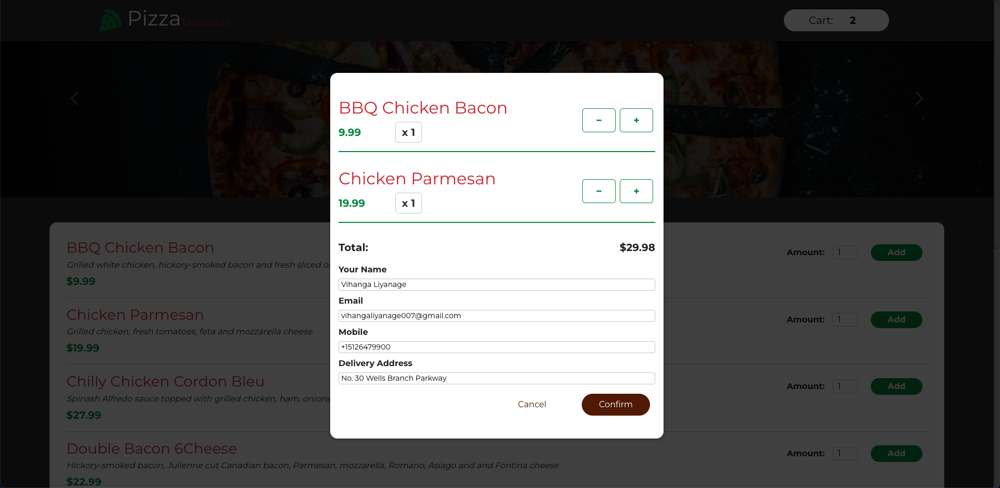

# React-Based Pizza App
This is a simple application written to work with the sample Pizza-Shack API of WSO2 API Manager.

Credits to the original author - https://github.com/Wydreq/Pizza-order-app


## Functionalities
- Load the Pizza menu from the REST API.
  - Uses the client credential grant to obtain an access token.
- Ability to add menu items to the shopping cart.
- Place pizza orders using the REST API.
  - Uses the authorization code grant to obtain an access token on behalf of a consumer.

## How to run
- Deploy the pizza-shack sample API in the API Manager.
- Enable CORS configurations for the OAuth 2 token encpoints. (https://stackoverflow.com/a/76826333/4281517)
- Create an application, set **Client Credentials** and **Code** as allowed grant types, and generate OAuth2 keys.
- Add a subscription to the Pizza API from the application.
- Clone the repository.
```
git clone https://github.com/vihanga-liyanage/apim-react-pizza-app
```

- Navigate to the cloned repository and open the config.js file.
```
cd apim-react-pizza-api
open open src/config.js
```

- Update the configs accordingly and save the file. **clientID**, **clientSecret** and **apiBaseUrl** should be enough for normal usage.
- Run the below command to start the application server.
```
npm install && npm start
```
- You should see the application automatically starting in your default browser on the URL http://localhost:3000

## Proposed Demo Story
1. Deploy the Pizza Shack service and create a REST API from it.
2. Explain the basic Portal Configurations and API Configurations.
3. Deploy the API. You can show that the API returns data by using the Try it window.
4. Fire up the Pizza application without doing any config modifications. It will show an error message as below. This can be used to explain the need for an application in the dev portal.

5. Create the application in the dev portal, update the app configs, and show that the Pizza menu is loading from the API. You can add items to the shopping cart as well.
6. Explain that different APIs need different access levels. In this scenario, /menu endpoint can be used by anyone to see the pizza menu, but a user account is needed to place orders.
7. Add an item to the cart, click on the cart, and click on checkout. It will ask the user to sign in.

8. Sign in with a user account that you have prepared. Once an authentication session is initiated, the app will populate the user's details to place an order.

9. Now you can place an order.
10. Apply a throttling policy that limits the API calls to 5 per minute to the API and refresh the application several times to show that the API is getting blocked after the threshold.


## Improvement
- The application can be configured to request a token with a specific scope to showcase fine-grained access control. This is not yet implemented.

## Contributions
Feel free to send any improvements, bug fixes, or suggestions as PRs. Please ping (vihanga@wso2.com) for quicker attention.
